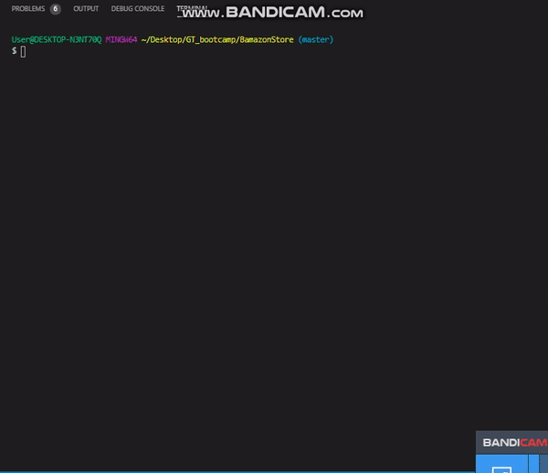
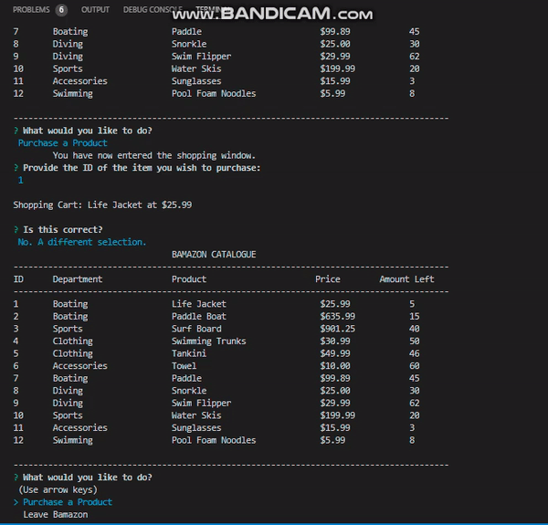
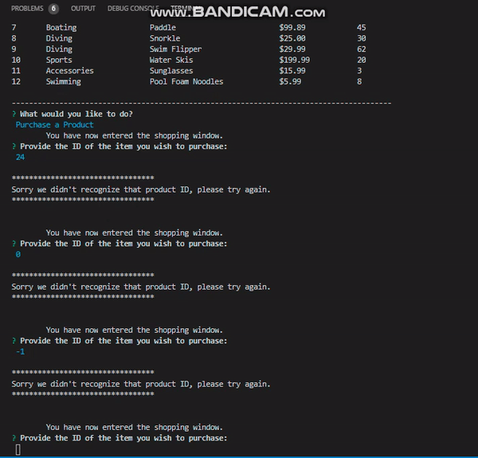
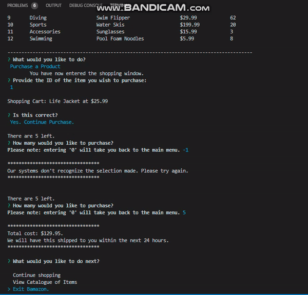
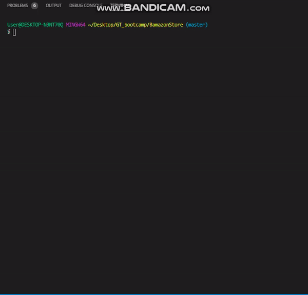
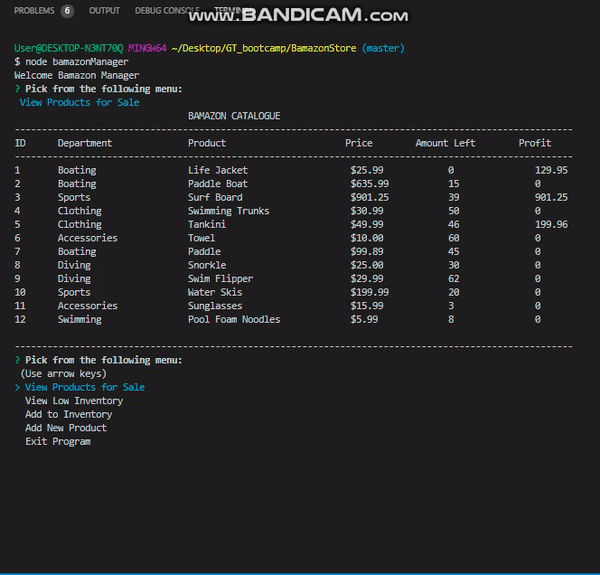
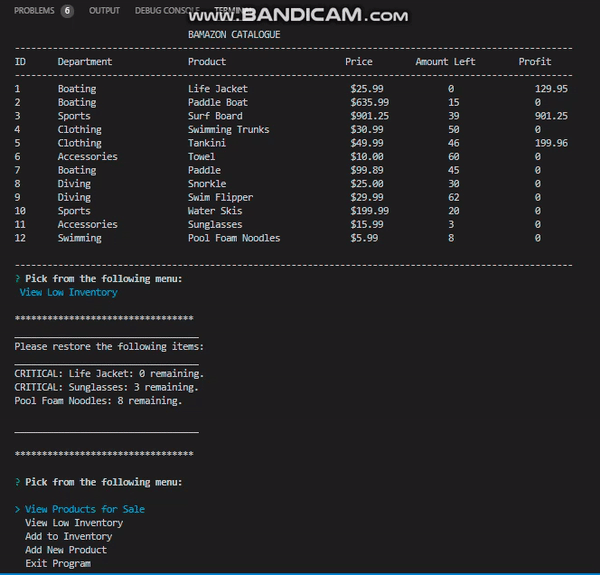
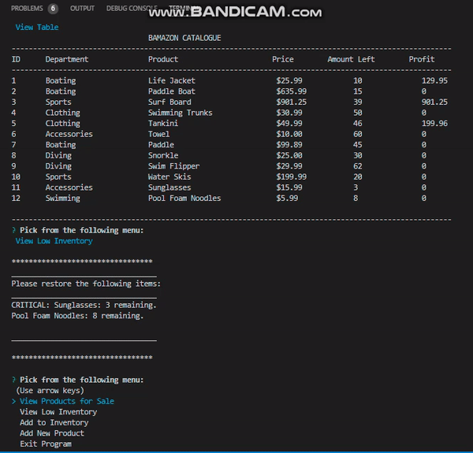
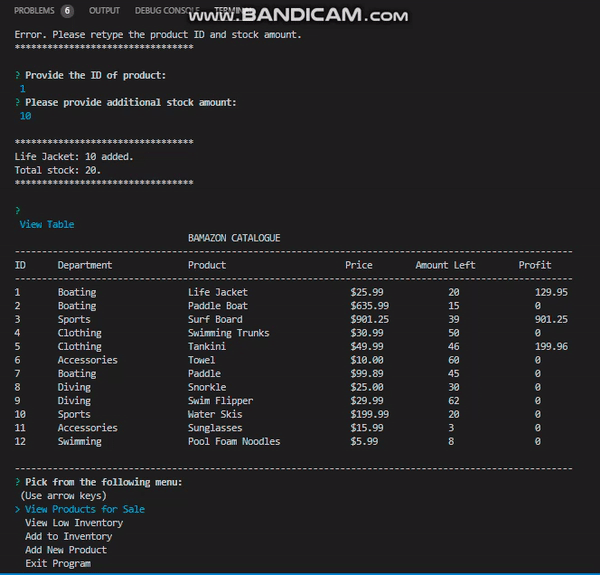
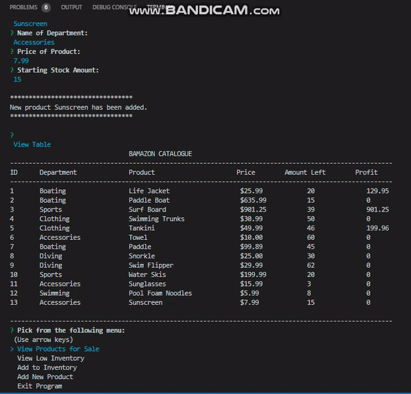

# BamazonStore

This is an app that conducts a store-like online application. It is based off of Amazon, hence the name "Bamazon." In this app there are two separate files. The customer has one experience, while the manager has a secondary experience on this app.

link to full video walkthrough: https://vimeo.com/user38192111/review/372566903/52f7a5e13e

## Getting Started:

This program runs on node.js only. Therefore, the user will have to interact directly with the terminal. All users need to have a program containing a terminal when downloading these files in order to interact with the app. I recommend Visual Studios. 

### Prequisites
In order to run this app, you must do the following:

    Open the SEED folder. Inside the SEED folder you will find a table named products. From there simply copy and paste the entire folder into the mysql database. 
    In my video I used MYSQL Workbench. I highly recommend this program.

### Installation Packages for using App
	> npm i inquirer                                                                                                  
	>npm i mysql                                                                
                                                                                 
### Running the Program

In order to run the Bamazon Customer program user must first type:
    > node bamazonCustomer
    
In order to run the Bamazon Manager program user must first type:
    > node bamazonManager

From there the user will be prompted to make a selection. A good portion of this feature contains validation input so as to prevent any mistakes or incorrect data from entering into mysql for a better user experience.

## Examples of the Program Running

### Customer Interaction
Beginning Customer program. Starts up the program and main menu selection.

Demonstrates validation of the product ID.

Demostrates validation of number of products selected.

Correct input, view table option, and exit program.

### Manager Interaction
Managers have the option to view the table. They also are allowed to see the profit on each product.

Managers can see what needs to be restocked. Since this is a "smaller" shop, I have anything below 10 appearing in the terminal as a warning. Anything below 5 has "CRITICAL" attached to alert the manager that there is a dire need for restocking that particular product.

Demonstrates how to add more product to increase the stock. This is what the manager should follow for the correct procedure.

If procedures are not followed correctly to "add inventory", then these are the validations made to aid user in correcting errors.

Demonstrates how to add a new product. This is what the manager should follow for the correct procedure.

If procedures are not followed correctly to "new product", then these are the validations made to aid user in correcting errors. And the exiting of the program.

## Features Included

Because this application has a "form-like" application, validation has been taken into account. This includes checking for Integers vs. Floats, making sure that the input is numbers and not anything else, making sure customers can't buy a negative amount of items nor can managers place a negative amount of items on stock. 

Formatted the currency as table prints.

Options to check if the user wants to continue and go back to main menu for better interactivity.

Had a bit of fun with creating letter art with the terminal for a more interesting experience.